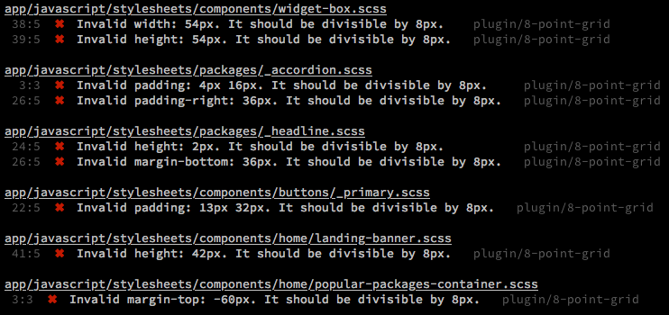

# stylelint-8-point-grid


Validates any defined `margin`, `padding`, `height`, and `width`



## Inspiration

- [Intro to The 8-Point Grid System](https://builttoadapt.io/intro-to-the-8-point-grid-system-d2573cde8632)
- [The 8-Point Grid](https://spec.fm/specifics/8-pt-grid)

### Ignores

- css calc() function
- sass variables

## Installation

### npm

```
npm install stylelint-8-point-grid --save-dev
```

### yarn

```
yarn add stylelint-8-point-grid --dev
```

## Usage

Update .stylelintrc or stylelint config in `package.json`

### Recommended config

```js
// .stylelintrc
{
  "extends": [
    "stylelint-8-point-grid"
  ]
}
```

## Extending the config

```js
// .stylelintrc
{
  "extends": [
    "stylelint-8-point-grid"
  ],
  "rules": {
    "plugin/8-point-grid": {
      "base": 4,
      "whitelist": ["2px", "1px"],
      "ignore": ["width", "height"]
    }
  }
}
```

### base (default: 8)

value used for divisibility checking

### whitelist

array of px values to be excluded from divisibility checking

### ignore

array of css properties to be excluded from divisibility checking

- margin
- margin-top
- margin-bottom
- margin-left
- margin-right
- padding
- padding-top
- padding-bottom
- padding-left
- padding-right
- height
- min-height
- max-height
- width
- min-width
- max-width
- top
- bottom
- right
- left

## License

MIT
