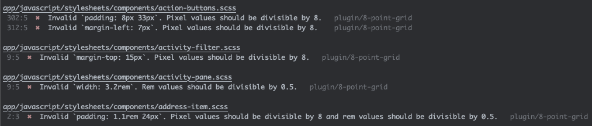

# stylelint-8-point-grid


[](https://www.npmjs.com/package/stylelint-8-point-grid)

A Stylelint plugin that ensures spacing values (margin, padding, height, width, etc.) adhere to an 8-point grid system.

```css
/* ❌ Invalid */
.element {
  margin: 5px; /* not divisible by 8 */
  padding: 0.3rem; /* not divisible by 0.5 */
}

/* ✅ Valid */
.element {
  margin: 8px; /* 1x grid */
  padding: 0.5rem; /* 1x grid */
}
```

## Features

✅ Validates pixel (`px`) and rem values
✅ Supports CSS Logical Properties
✅ Configurable base value (default: 8px / 0.5rem)
✅ Allowlist for exceptions
✅ Ignore specific properties



## Installation

```bash
npm install stylelint-8-point-grid --save-dev
# or
yarn add stylelint-8-point-grid --dev
```

## Quick Start

Add to your `.stylelintrc`:

```json
{
  "extends": ["stylelint-8-point-grid"]
}
```

This enforces the default 8px grid (0.5rem for rem values).

### Options

```json
{
  "extends": ["stylelint-8-point-grid"],
  "rules": {
    "plugin/8-point-grid": {
      "base": 4,
      "allowlist": ["2px", "1px", "0.0625rem"],
      "customProperties": ["size", "position"],
      "ignorelist": ["width", "height"]
    }
  }
}
```

| Option             | Type     | Default | Description                                                                                         |
| ------------------ | -------- | ------- | --------------------------------------------------------------------------------------------------- |
| `base`             | number   | `8`     | Base grid value. Pixel values must be divisible by this. Rem values must be divisible by `base/16`. |
| `allowlist`        | string[] | `[]`    | Values to exclude from validation                                                                   |
| `customProperties` | string[] | `[]`    | Additional CSS properties to validate                                                               |
| `ignorelist`       | string[] | `[]`    | CSS properties to skip validation                                                                   |

### Supported Properties

<details>
<summary>View all 39 properties</summary>

**Box Model**

- `margin`, `margin-top`, `margin-bottom`, `margin-left`, `margin-right`
- `padding`, `padding-top`, `padding-bottom`, `padding-left`, `padding-right`
- `height`, `min-height`, `max-height`
- `width`, `min-width`, `max-width`

**Positioning**

- `top`, `bottom`, `left`, `right`

**CSS Logical Properties**

- `margin-block`, `margin-block-start`, `margin-block-end`
- `margin-inline`, `margin-inline-start`, `margin-inline-end`
- `padding-block`, `padding-block-start`, `padding-block-end`
- `padding-inline`, `padding-inline-start`, `padding-inline-end`
- `block-size`, `min-block-size`, `max-block-size`
- `inline-size`, `min-inline-size`, `max-inline-size`
- `inset`, `inset-block`, `inset-inline`
- `inset-block-start`, `inset-block-end`
- `inset-inline-start`, `inset-inline-end`

</details>

## Limitations

The following patterns are ignored as they require runtime or preprocessing context:

- **CSS `calc()` functions** - computed at runtime
- **Sass/SCSS variables** - values unavailable during linting

```css
/* Ignored examples */
.element {
  width: calc(100% - 31px);
  margin: $spacing;
}
```

**Workarounds:**

- Use pre-calculated CSS custom properties or utility classes
- Ensure variables follow grid values (e.g., `$spacing: 8px`)
- Document grid compliance in comments when using `calc()`

## Best Practices

1. **Design Tokens**: Pre-calculate grid-compliant values

   ```css
   :root {
     --spacing-sm: 8px; /* 1x */
     --spacing-md: 16px; /* 2x */
     --spacing-lg: 24px; /* 3x */
   }
   ```

2. **Utility Classes**: Common spacing patterns

   ```css
   .p-1 {
     padding: 8px;
   }
   .p-2 {
     padding: 16px;
   }
   .m-1 {
     margin: 8px;
   }
   .m-2 {
     margin: 16px;
   }
   ```

3. **Document calc() usage**
   ```css
   /* 16px margins = 2x grid */
   .container {
     width: calc(100% - 32px);
     margin: 0 16px;
   }
   ```

## References

- [Intro to The 8-Point Grid System](https://builttoadapt.io/intro-to-the-8-point-grid-system-d2573cde8632)
- [The 8-Point Grid](https://spec.fm/specifics/8-pt-grid)

## License

MIT
